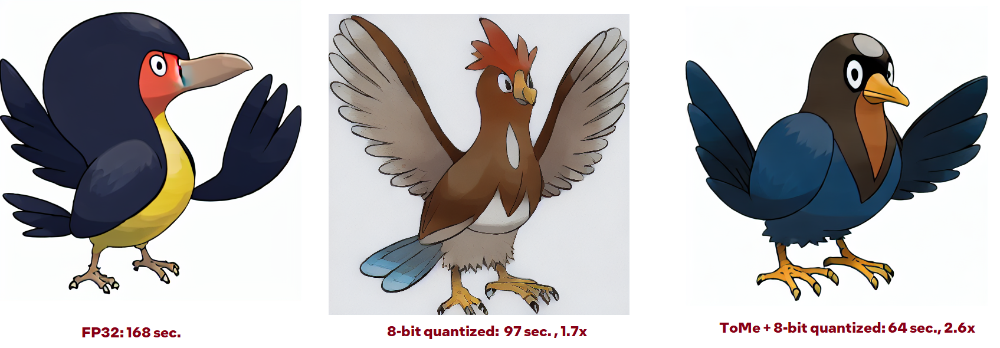

# Token Merging for Stable Diffusion running with OpenVINO

This is an OpenVINO adoped version of Token Merging method. The method is applied to PyTorch model before exporting to OpenVINO representation. It can be also stacked with 8-bit quantization to achieve a higher inference speed. 
The repository contains implementation for:
- Stable Diffusion (HF Diffusers based models), see [example](https://github.com/huggingface/optimum-intel/tree/main/examples/openvino/stable-diffusion).
- OpenCLIP, see [example](https://github.com/AlexKoff88/open_clip/blob/openvino_alt/tutorials/openvino/openvino_tome.ipynb).
- Timm


Here are the results for 100 iteration of 512x512 image generation on CPU.


This is the official implementation of **ToMe for SD** from the paper:  
**[Token Merging for Fast Stable Diffusion](https://arxiv.org/abs/2303.17604)**

ToMe for SD is an extension of the original **ToMe**:  
**[Token Merging: Your ViT but Faster](https://arxiv.org/abs/2210.09461)**  


**Note:** This also supports most downstream UIs that use these repositories.

## Installation

ToMe for SD requires ``pytorch >= 1.12.1`` (for `scatter_reduce`), which you can get from [here](https://pytorch.org/get-started/locally/). Then after installing your choice of stable diffusion environment ([supported environments](#supported-environments)), use the corresponding python environment to install ToMe for SD:

```bash
pip install git+https://github.com/AlexKoff88/tomesd.git@openvino_clip
```

## Usage
* Diffusers:
```py
import torch, tomeov
from diffusers import StableDiffusionPipeline

pipe = StableDiffusionPipeline.from_pretrained("runwayml/stable-diffusion-v1-5")

save_dir = "stable_diffusion_optimized"
# Apply ToMe with a 50% merging ratio
tomeov.patch_stable_diffusion(pipe, ratio=0.5) # Can also use pipe.unet in place of pipe here
```
* OpenCLIP:
```py
import torch, tomeov
import open_clip
from open_clip import tokenizer

model, _, preprocess = open_clip.create_model_and_transforms("ViT-B-16-plus-240", pretrained="laion400m_e32")

tomeov.patch_openclip(model, 8) # 8 - number of tokens merged in each MHSA from top down
```
* Timm:
```py
import torch, tomeov
import timm

model_name = 'vit_tiny_patch16_224'
model = timm.create_model(model_name, pretrained=True)

tomeov.patch_timm(model, 4) # 8 - number of tokens merged in each MHSA from top down
```
